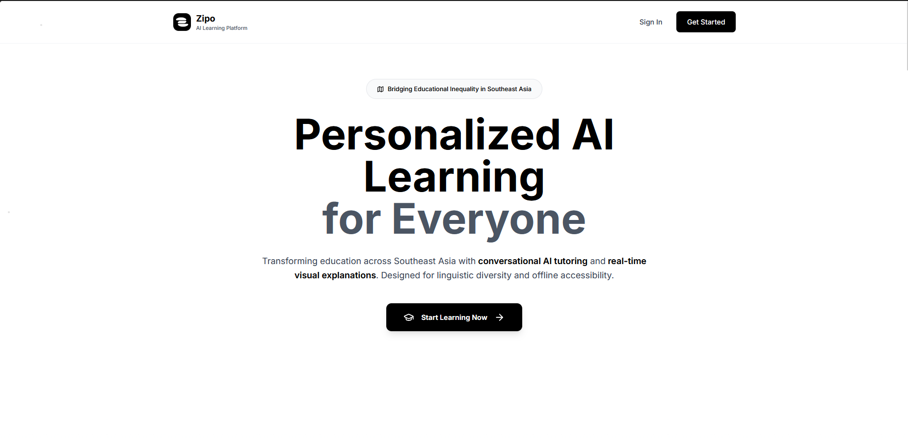
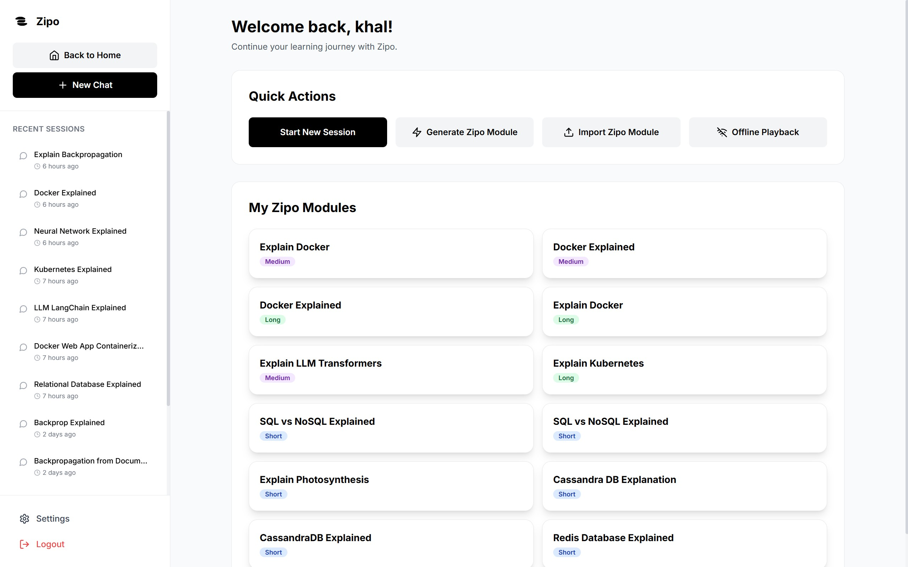
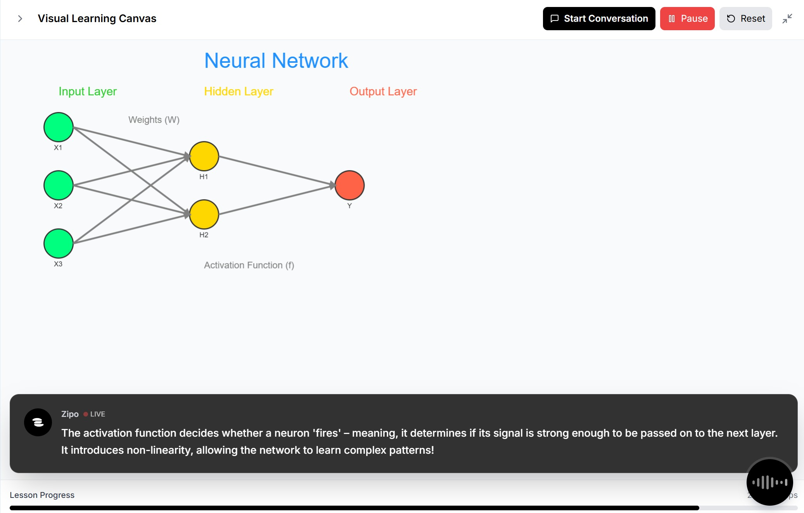
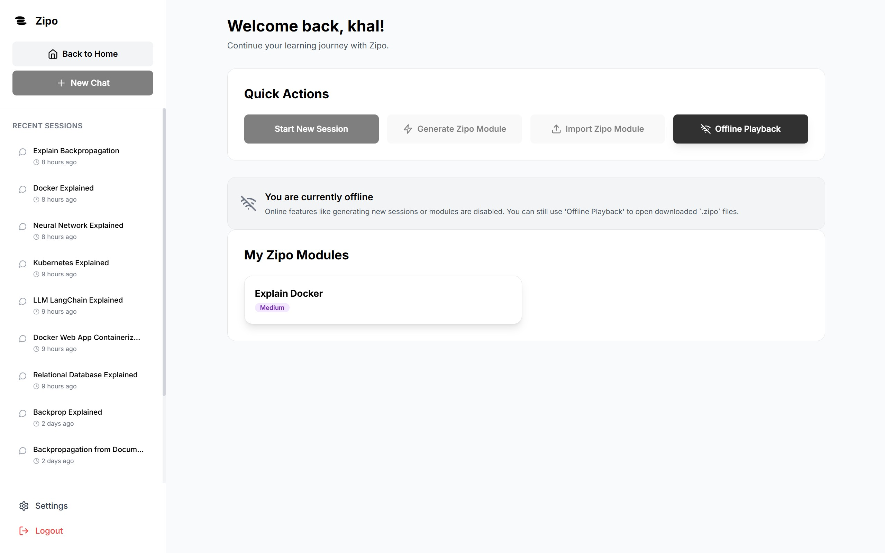

# Zipo - AI Generative Learning

<p align="center">
  
</p>

<h3 align="center">Bridiging Educational Gaps in Southeast Asia with Personalized and Accessible Learning Platform.</h3>

[](#)
[](#)
[](#)
[](#)
[](#)

---
> **Live Demo:** Try Zipo now at **[zipoai.xyz](https://zipoai.xyz)**
>
> **Recommended Browser:** Google Chrome
---

## 🌏 Background: The Challenge of Educational Equity

Southeast Asia is a region of immense potential, home to over 693 million people. However, this potential is constrained by a significant educational divide. For millions, access to quality learning is limited by:

*   **Language Barriers:** With over 1,000 languages spoken, educational materials are often not available in a student's native tongue.
*   **Infrastructure Gaps:** A significant portion of the population lives in rural areas with limited or unreliable internet access, making online learning a challenge.
*   **Outdated Methods:** Traditional, one-size-fits-all learning models fail to engage students or cater to individual learning paces.

Zipo was born from a single question: **How can we deliver a world-class, personalized education to every learner, regardless of their location, language, or internet access?** Our answer lies in rethinking not just the tools, but the very methodology of digital learning.

## 🚀 About The Project

<p align="center">
    
</p>

Zipo is a **Personalized AI Learning Platform (PWA)** that turns any document into an active, visual conversation. Instead of passively reading, learners interact with an AI tutor that draws on a generative whiteboard and speaks explanations — even fully offline via portable .zipo modules.

**Why Zipo?** Across Southeast Asia, access to quality education is limited by language, bandwidth, and outdated learning modes. Zipo rethinks learning around *accessibility, personalization, and portability*.

## ✨ Key Features

Our technology is built on four core pillars to make our mission possible:

*   **🤖 The Generative Canvas:** The AI produces structured tool calls (e.g., `drawRectangle`, `createTable`) that the frontend (React‑Konva) renders into real‑time visual explanations with synchronized TTS.

*   **🧠 Agentic RAG (Retrieval-Augmented Generation):** Multi‑turn tool calling performs targeted retrieval from the user’s documents only when needed, making RAG smarter and more scalable.

*   **🌐 Portable `.zipo` Modules:** Export interactive lessons, including all visual commands and pre-synthesized audio, into a single portable file for easy sharing and distribution.

*   **🔌 Zipo Offline Playback:** Play downloaded `.zipo` modules on any device with the Zipo PWA, with zero internet connection required. This is how we ensure learning continuity, everywhere.


## 🖼️ Visual Showcase

Here's a glimpse of Zipo in action.

**The Dashboard: Your Learning Hub**


**An Active Learning Session: Chat & Canvas**


**Bringing Concepts to Life**


**Offline Playback**



## 👥 Meet The Team

**AI-Native Agentic RAG Vertical B2B SaaS**

| Photo | Name | Role |
| :---: | :---: | :---: |
|  | **Khalfani Shaquille** | Backend & AI Engineer |
|  | **Varel Tiara** | Fullstack Developer |
|  | **M Ikhbar A** | Frontend & DevOps |

## 🛠️ Getting Started & Deployment Guide

This guide will walk you through setting up and running the Zipo project.

### Prerequisites

Make sure you have the following software installed on your machine:
*   [Git](https://git-scm.com/)
*   [Node.js](https://nodejs.org/) (v18 or higher recommended)
*   [Docker](https://www.docker.com/products/docker-desktop/)

### Configuration

The backend service requires environment variables and Google Cloud credentials.

1.  **Create an Environment File:**
    In the root directory of the project, create a file named `.env`.

2.  **Populate `.env`:**
    Add the following environment variables to the `.env` file. These are essential for the database connection, authentication, and AI services.

    ```
    # Set to 'production'
    NODE_ENV=production

    # MongoDB connection string
    MONGO_URI=mongodb://mongo:27017/zipo

    # A strong, random secret for signing JWTs
    JWT_SECRET=your_jwt_key_here

    # API key for Google Generative AI
    LLM_API_KEY=YOUR_GEMINI_API_KEY

    # The public URL of the frontend for production
    FRONTEND_URL=https://zipoai.xyz

    # Path to Google Cloud credentials file inside the backend container
    GOOGLE_APPLICATION_CREDENTIALS=/app/google-credentials.json


    #SEALION API
    SEALION_API_KEY=YOUR_SEALION_API_KEY
    SEALION_API_BASE_URL=https://api.sea-lion.ai/v1
    ```

3.  **Google Credentials:**
    The application uses Google Cloud services (Speech-to-Text, Text-to-Speech). You need a Google Cloud service account key.
    *   Obtain your `google-credentials.json` key file from the Google Cloud Console.
    *   Place this file inside the `backend/` directory.

### 🚀 Deployment with Docker (Recommended)

This is the simplest way to get the entire application stack (Frontend, Backend, Database) running.

1.  **Clone the repository:**
    ```sh
    git clone <your-repository-url>
    cd zipo-ai
    ```

2.  **Run Docker Compose:**
    From the root directory, run the following command. This will build the frontend and backend images and start all the necessary services.

    ```sh
    docker-compose -f docker-compose.http.yml up --build
    ```

3.  **Access the application:**
    Once the build is complete and the containers are running, you can access the Zipo application at `http://localhost` in your web browser.

